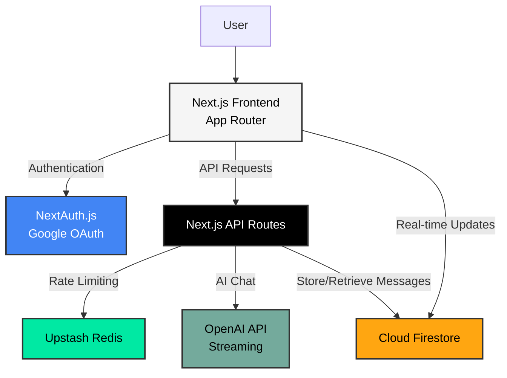

<div align="center">
  <a href="https://gpt.nabarun.app">
    
  </a>

  <br/>

  <h1 align="center">ChadGPT</h1>

  <p align="center">
    Your low-key AI agent for the new era!
    <br />
    <a href="https://gpt.nabarun.app"><strong>View Project »</strong></a>
    <br />
    <br />
    <a href="https://github.com/nabarvn/chadgpt/issues">Report Bug</a>
    •
    <a href="https://github.com/nabarvn/chadgpt/issues">Request Feature</a>
  </p>
</div>

## Overview

<div align="center">
  
</div>

<br />

ChadGPT is a full-stack GPT implementation built with Next.js 13, featuring a custom AI persona that delivers direct, confident responses. It streams answers in real-time from OpenAI's API, automatically syncs your chat history across devices with Firebase, and includes Google OAuth authentication. The interface supports full markdown rendering with syntax-highlighted code blocks, while Upstash Redis rate limiting prevents API abuse.

## Architecture

The diagram below illustrates the high-level architecture of the ChadGPT application.



## Running Locally

Follow these steps to set up and run ChadGPT on your local machine.

### Prerequisites

This application requires:

- [Node.js](https://nodejs.org/en) v20.14.0+
- A [Firebase](https://firebase.google.com) account (free tier is sufficient)
- A [Google Cloud Console](https://console.cloud.google.com) account for OAuth credentials
- An [OpenAI](https://platform.openai.com/api-keys) account for API keys
- An [Upstash Redis](https://console.upstash.com) account (free tier is sufficient)

### 1. Cloning the Repository

Clone the repository to your local machine:

```bash
git clone https://github.com/nabarvn/chadgpt.git
cd chadgpt
```

### 2. Installing Dependencies

Install all required dependencies:

```bash
npm install
```

### 3. Firebase Setup

Create a Firebase project and configure the following:

1. Enable **Firestore Database** preferably in test mode to avoid writing security rules
2. Register a web app and note the config values (apiKey, authDomain, projectId, etc.)
3. Generate Admin SDK credentials from **Service Accounts** (download the JSON)

See the [Firebase Console](https://console.firebase.google.com) and [Firestore documentation](https://firebase.google.com/docs/firestore/quickstart).

### 4. Google OAuth Setup

Create OAuth 2.0 credentials in [Google Cloud Console](https://console.cloud.google.com):

- Set authorized redirect URI: `http://localhost:3000/api/auth/callback/google`
- Copy the Client ID and Client Secret

Refer to the [OAuth 2.0 documentation](https://developers.google.com/identity/protocols/oauth2) if needed.

### 5. OpenAI API Key

Generate an API key from the [OpenAI Platform](https://platform.openai.com/api-keys).

### 6. Upstash Redis Setup

Create a Redis database in [Upstash Console](https://console.upstash.com) and copy the REST URL and token.

### 7. Environment Variables

Create a local environment file by copying the example:

```bash
cp .env.example .env
```

> [!IMPORTANT]
> Open the newly created `.env` file and populate it with your API keys and configuration values.

For development, set `NEXTAUTH_URL` to your localhost URL.

To generate a secure `NEXTAUTH_SECRET`:

```bash
openssl rand -base64 32
```

### 8. Running the Application

Start the development server:

```bash
npm run dev
```

The application will be available at [http://localhost:3000](http://localhost:3000)

## Tech Stack

### Core Framework

- **[TypeScript](https://www.typescriptlang.org)** - Type-safe JavaScript
- **[Next.js 13](https://nextjs.org)** - React framework with App Router
- **[React 18](https://react.dev)** - JavaScript library for building UI

### Styling & UI

- **[Tailwind CSS](https://tailwindcss.com)** - Utility-first CSS framework
- **[Tailwind Typography](https://tailwindcss.com/docs/typography-plugin)** - Beautiful typographic defaults
- **[Headless UI](https://headlessui.com)** - Unstyled, accessible UI components
- **[Heroicons](https://heroicons.com)** - Beautiful hand-crafted SVG icons
- **[next-themes](https://github.com/pacocoursey/next-themes)** - Dark mode support

### Authentication

- **[NextAuth.js](https://next-auth.js.org)** - Authentication for Next.js
- **[Google OAuth Provider](https://next-auth.js.org/providers/google)** - Secure Google sign-in

### Database & Real-time

- **[Cloud Firestore](https://firebase.google.com/docs/firestore)** - NoSQL cloud database
- **[Firebase Admin SDK](https://firebase.google.com/docs/admin/setup)** - Server-side Firebase operations
- **[react-firebase-hooks](https://github.com/csfrequency/react-firebase-hooks)** - React hooks for Firebase

### AI & Streaming

- **[OpenAI API](https://platform.openai.com/docs/introduction)** - GPT language models
- **[Vercel AI SDK](https://sdk.vercel.ai/docs)** - Streaming AI responses

### Rate Limiting & Caching

- **[Upstash Redis](https://upstash.com/docs/redis/overall/getstarted)** - Serverless Redis
- **[@upstash/ratelimit](https://github.com/upstash/ratelimit)** - Rate limiting library

### Content Rendering

- **[React Markdown](https://github.com/remarkjs/react-markdown)** - Markdown component for React
- **[remark-gfm](https://github.com/remarkjs/remark-gfm)** - GitHub Flavored Markdown support
- **[rehype-highlight](https://github.com/rehypejs/rehype-highlight)** - Syntax highlighting for code blocks

### State Management & Data Fetching

- **[SWR](https://swr.vercel.app)** - React hooks for data fetching
- **[React Hot Toast](https://react-hot-toast.com)** - Notifications

### Utilities

- **[react-device-detect](https://github.com/duskload/react-device-detect)** - Device detection
- **[react-scrollable-feed](https://github.com/dizco/react-scrollable-feed)** - Auto-scrolling chat
- **[react-textarea-autosize](https://github.com/Andarist/react-textarea-autosize)** - Auto-growing textarea
- **[react-copy-to-clipboard](https://github.com/nkbt/react-copy-to-clipboard)** - Copy code functionality

## Key Features

- **Real-time AI Response Streaming** - Watch AI responses appear as they're generated
- **Persistent Chat History** - All conversations automatically saved and synced across devices
- **Full Markdown Rendering** - Rich text formatting with code syntax highlighting
- **Rate Limiting Protection** - Built-in API protection with Redis-backed rate limiting
- **Responsive Design** - Seamless experience on desktop, tablet, and mobile devices
- **Dark/Light Theme** - Toggle between themes to suit your preference
- **Code Block Copy** - One-click copy functionality for code snippets

<hr />

<div align="center">Don't forget to leave a STAR 🌟</div>
