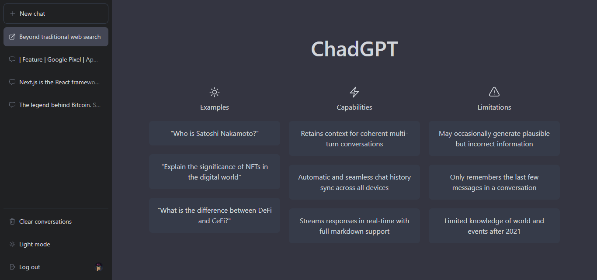

<!-- PROJECT LOGO -->
<br />
<div align="center">
  <a href="https://chad.nabarun.ai">
    
  </a>

  <h2 align="center">ChadGPT</h2>

  <p align="center">
    Your low-key AI agent for the new era!
    <br />
    <a href="https://chad.nabarun.ai"><strong>View Project »</strong></a>
    <br />
    <br />
    <a href="https://github.com/nabarvn/chadgpt/issues">Report Bug</a>
    ·
    <a href="https://github.com/nabarvn/chadgpt/issues">Request Feature</a>
  </p>
</div>


<!-- ABOUT THE PROJECT -->
## About The Project

<div align="center">
  
</div>

ChadGPT features a clean and intuitive user interface. Users can interact with the app via a simple chat interface, which is accessible from any device with an internet connection. The app's sleek design and ease of use make it a valuable tool for anyone seeking an intelligent and personalized conversational experience.


### Built With

* Typescript
* Next.js
* Tailwind CSS
* Cloud Firestore
* OpenAI API
* Next Auth
* SWR


<!-- GETTING STARTED -->
## Getting Started

First, run the development server:

```bash
npm run dev
# or
yarn dev
# or
pnpm dev
```

Open [http://localhost:3000](http://localhost:3000) with your browser to see the result.

You can start editing the page by modifying `app/page.tsx`. The page auto-updates as you edit the file.

[API routes](https://nextjs.org/docs/api-routes/introduction) can be accessed on [http://localhost:3000/api/hello](http://localhost:3000/api/hello). This endpoint can be edited in `pages/api/hello.ts`.

The `pages/api` directory is mapped to `/api/*`. Files in this directory are treated as [API routes](https://nextjs.org/docs/api-routes/introduction) instead of React pages.

This project uses [`next/font`](https://nextjs.org/docs/basic-features/font-optimization) to automatically optimize and load Inter, a custom Google Font.


<!-- LEARN MORE -->
## Learn More

To learn more about Next.js, take a look at the following resources:

- [Next.js Documentation](https://nextjs.org/docs) - learn about Next.js features and API.
- [Learn Next.js](https://nextjs.org/learn) - an interactive Next.js tutorial.

You can check out [the Next.js GitHub repository](https://github.com/vercel/next.js/) - your feedback and contributions are welcome!


<!-- DEPLOY -->
## Deploy on Vercel

The easiest way to deploy your Next.js app is to use the [Vercel Platform](https://vercel.com/new?utm_medium=default-template&filter=next.js&utm_source=create-next-app&utm_campaign=create-next-app-readme) from the creators of Next.js.

Check out our [Next.js deployment documentation](https://nextjs.org/docs/deployment) for more details.


<!-- CREDITS -->
## Credits

Thanks to *Sonny Sangha* for all of the amazing and knowledge packed content that he puts out on the internet. I hope I was able to do justice to that!

<hr />

<div align="center">Don't forget to leave a STAR ⭐️</div>
